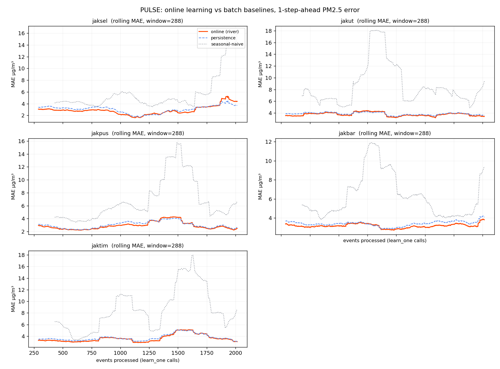

<!-- LIVE URL: isi setelah deploy. Ganti seluruh baris "Live demo" di bawah dengan URL asli, contoh:
     **Live demo:** https://pulse-jakarta.vercel.app  ·  backend: https://ne-he-pulse-backend.hf.space
     Slot ini sengaja ditaruh di bawah frontmatter, bukan di baris 1 file, karena baris 1 harus
     tetap `---` supaya Hugging Face Spaces bisa membaca konfigurasi sdk/app_port di atas. -->
**Live demo:** *(belum di-deploy, lihat [`docs/DEPLOY.md`](docs/DEPLOY.md))*

# PULSE — Jakarta Air Quality, after deploy

**Real-time air-quality intelligence for Jakarta: stream → online forecast →
anomaly detection → drift-triggered retraining → auto model card → LLM incident
card. One `docker compose up`.**

> **Flagship commitment:** PULSE is the single flagship project. The RAG résumé
> chatbot is parked until PULSE ships and is deployed publicly.

Most ML portfolios stop at *"I trained a model."* PULSE is about **what happens
after deploy**: the model keeps learning per-event, monitors itself for drift,
retrains and re-documents itself when the world changes, and narrates anomalies in
plain language. On real, local, streaming Jakarta data.

<!-- TODO: drop the demo GIF here once the dashboard MVP is green:
     spike button → chart jumps → incident card appears -->
<!--  -->

---

## The loop (this is the whole point)

```
OpenAQ + Weather API  ──(replay or live)──►  Redis Stream  aq.events
        │
        ▼
  ml/online/consumer.py
        ├─► river: forecast PM2.5 (horizon) + uncertainty band
        ├─► river: learn_one(x, y)        ⭐ TRUE online update, per event (not batch)
        └─► anomaly: HalfSpaceTrees → flag spikes
        │
        ├─► aq.predictions ──► API (WebSocket) ──► dashboard live chart
        ├─► aq.alerts ──► agent (Gemini) ──► aq.incidents ──► dashboard feed
        └─► drift (Evidently/PSI, windowed, PER STATION) ──► if any station drifts ──► retrain
                                                                    ──► registry + new model card
```

**What makes this not a tutorial:** `learn_one()` is called on *every* event (true
online learning, not batch retraining in disguise), and the **drift → retrain →
new version → new model card** loop closes back on itself automatically.

---

## Quickstart

```bash
cp .env.example .env          # defaults run in REPLAY mode — no keys, no internet
docker compose up --build     # redis + ingestion + ml + agent + api
```

Then:
- **Dashboard: http://localhost:3000** — the live ops center (Jakarta AQ, forecast
  chart, incident feed, demo controls). Served automatically by the `dashboard` service.
- API + interactive docs: **http://localhost:8000/docs**
- Health: **http://localhost:8000/health**
- Minimal reference harness (optional): open **`tools/devboard.html`**.

The dashboard (`Frontend_pulse/`) is a dc-runtime UI wired to the API over WebSocket +
REST. Data-shape contract lives in
[`Frontend_pulse/FRONTEND_SPEC.md`](Frontend_pulse/FRONTEND_SPEC.md).

### Demo script (for recruiters)
1. `docker compose up` → charts start moving (replay streams synthetic Jakarta data).
2. Hit **Trigger Spike** (devboard or dashboard) → within ~1s: anomaly flagged →
   Gemini/template **incident card** appears → forecast band widens.
3. Let it run → drift accumulates → **auto-retrain** → new model version + model card
   in the registry. Show the version history. That's the "after deploy" story.

### No Docker? Run the brain offline
```bash
pip install -r requirements.txt
python -m scripts.smoke        # end-to-end pipeline check, no Redis needed
python -m ml.batch.baseline    # M1 batch baselines (comparison point)
python -m scripts.error_curve  # online vs baseline curve → docs/error_curve.png + METRICS.md
python -m scripts.bench        # throughput / latency / retrain rate → docs/bench.json
pytest -q                      # unit tests
```

---

## Results

Everything below was measured by replaying `data/sample_aq.csv` (10,080 events, 5 stations,
14 days at 10-minute resolution) through the same `Engine` the consumer runs. Regenerate it
all with `python -m scripts.error_curve` and `python -m scripts.bench`. Full tables and
caveats: [`docs/METRICS.md`](docs/METRICS.md).

### Online learning vs batch baselines



1-step-ahead PM2.5 error. All three models predict `y_t` from information available at
`t-1`, so the comparison is fair.

| Station | Online MAE | Persistence MAE | Seasonal-naive MAE | Online RMSE | Persistence RMSE |
|---|---|---|---|---|---|
| `jaksel` | **2.980** | 3.069 | 6.470 | 6.148 | **5.931** |
| `jakut` | **3.753** | 3.861 | 8.782 | **5.860** | 5.896 |
| `jakpus` | **2.856** | 2.977 | 6.618 | **4.978** | 5.069 |
| `jakbar` | **3.255** | 3.493 | 6.716 | **4.736** | 4.956 |
| `jaktim` | **3.557** | 3.687 | 8.657 | **5.808** | 5.879 |
| **mean** | **3.280** | 3.417 | 7.449 | n/a | n/a |

**Interpretation, including the part that does not flatter the model:** online learning
beats both batch baselines on MAE at all five stations, but only by 3 to 7 percent over
persistence, it needs roughly 1,100 to 2,000 events (8 to 14 days of data) before it stays
ahead, and at `jaksel` it loses on RMSE (6.148 vs 5.931) because it is caught out by
sudden spikes that persistence absorbs one step later. Learning per event is worth it
here, and it is worth it modestly, not dramatically.

### Measured throughput (`python -m scripts.bench`)

| Number | Measured |
|---|---|
| Event throughput | **270 events/sec** (10,080 events in 37.4 s) |
| Event → prediction latency | **2.6 ms** median (p95 4.3 ms, p99 16.3 ms) |
| Retrains per hour of replayed data | **0.069** (23 retrains over 335.8 h of data) |
| Retrains per wall-clock hour at `REPLAY_SPEED=600` | **41** |
| Events flagged as anomalies | **58.3%** (5,873 of 10,080) |

Measured on the ML pipeline with an in-memory bus (forecast → `learn_one` → anomaly →
drift → retrain), so Redis network time is excluded. These are the brain's numbers, not
end-to-end service numbers.

**The anomaly rate is a known problem, not a feature.** A detector that fires on 58% of
events is not selecting anything, and shipped as-is it would turn the dashboard incident
feed into noise. `anomaly_threshold = 0.85` is too loose for HalfSpaceTrees on this data.
It is reported here rather than quietly retuned, because picking a new threshold is a
calibration decision that should be made against a labelled set, not chosen to make a
number look better. Detail in `docs/TEST_GAP_MAP.md` section 6b.

---

## Live vs Replay

| Mode | What it does | Needs |
|---|---|---|
| `replay` (default) | streams a historical/synthetic CSV as if live, time-compressed; supports on-demand spikes | nothing |
| `live` | polls real Jakarta AQ + weather | OpenAQ key optional (falls back to keyless Open-Meteo) |

Set `INGEST_MODE` in `.env`. **Replay is the demo weapon:** Jakarta isn't always
spiking, so replay lets you reproduce a spike→anomaly→incident moment on demand,
every time a recruiter is watching.

---

## Tech stack

`Python` · **`river`** (online ML — the one new thing) · `Redis Streams` (bus) ·
`FastAPI` + `WebSockets` · `Evidently` (drift, with PSI fallback) · `Gemini`
(incident cards, with deterministic template fallback) · local JSON model registry
(Supabase-ready) · `Docker Compose` · static dc-runtime dashboard in `Frontend_pulse/`,
served by nginx on port 3000 (the Next.js layout in `FRONTEND_SPEC.md` section 4 is a
plan, not what ships) ·
`GitHub Actions` (CI + scheduled retrain).

### Deliberately pruned for shipping (v1)
- **Redis Streams**, not Redpanda.
- **Local JSON registry**, not Supabase yet (swap only `ml/registry/registry.py`).
- **DVC** wired later; sample data generator stands in for now.
- The one genuinely new thing — **streaming + online learning (river)** — is where
  the effort goes.

---

## Repo structure

```
pulsev2/
├── docker-compose.yml      # one command runs the whole loop
├── common/                 # shared contract: config, schemas, redis bus, AQI health
├── ingestion/              # SERVICE 1 — producer (live) + replay (demo) + sample gen
├── ml/
│   ├── online/             # model (river SNARIMAX + baseline fallback), consumer, anomaly
│   ├── batch/baseline.py   # M1 batch comparison
│   ├── monitoring/drift.py # Evidently drift (+ PSI fallback)
│   ├── registry/           # versioned model registry (local JSON)
│   └── modelcard/          # auto model card per promotion
├── agent/                  # SERVICE 2 — Gemini incident cards (+ template fallback)
├── api/                    # SERVICE 3 — FastAPI REST + WebSocket + demo control
├── Frontend_pulse/         # SERVICE 4: the dashboard (+ FRONTEND_SPEC.md contract)
├── tools/devboard.html     # throwaway harness to watch the backend live
├── scripts/
│   ├── smoke.py            # offline end-to-end pipeline check
│   ├── error_curve.py      # online vs batch baselines → docs/error_curve.png + METRICS.md
│   └── bench.py            # REPLAY-mode throughput / latency / retrain rate
├── docs/                   # METRICS.md, TEST_GAP_MAP.md, error_curve.png, bench.json
├── tests/                  # unit tests
└── .github/workflows/      # ci.yml (lint+test) · retrain.yml (scheduled/manual)
```

---

## Milestones

- **M1 — Foundation:** ingestion + replay + baseline forecast with uncertainty. *(scaffold done)*
- **M2 — Online core:** river incremental updates + anomaly detection + live dashboard.
- **M3 — Lifecycle:** Evidently drift + auto-retrain + registry + model cards. *(loop wired)*
- **M4 — Agent + launch:** Gemini incident cards + alerting + deploy + README/GIF/build log.

Target: ship and deploy publicly in ~8–10 weeks. Don't let it become version four
of a portfolio that never launched.

---

## Build log

Keep decisions, trade-offs, and failures here — it's ~30% of the recruiter value.

- **2026-06-22** — Scaffolded the full walking skeleton: all services connect
  end-to-end in replay mode; offline smoke + unit tests green. river/Evidently/Gemini
  each have a graceful fallback so the loop never hard-fails. Next: build the dashboard
  MVP (live chart + status header + station selector + incident feed).

- **2026-08-02**: Wrote tests for the claims instead of trusting them, and two of the
  claims turned out to be false.

  **Online learning was never running.** `StationModel` built `SNARIMAX(..., m=0)`. In
  river, `m` is the seasonal period and "no seasonality" is `m=1`; `m=0` makes SNARIMAX
  build lag features with a zero-step `range()`, which raises `ValueError` on the *first*
  `learn_one` call. The `except` block below it then dropped the station to a last-value
  baseline, permanently and silently. Every "online" forecast in this repo was
  persistence. The old tests could not see it: they asserted `n == 60` and
  `mae is not None`, both of which are true in the degraded mode. A silent fallback looks
  exactly like a working system, which is the real lesson here.

  **With learning switched on, the model diverged.** The MA term feeds the model's own
  residuals back in as features, so at river's default learning rate the errors compound:
  mean 1-step MAE around 5.5e10 µg/m³. Fixed by differencing (`d=1`) and slower learning
  rates, chosen by measuring four configurations rather than guessing, then stress-tested
  over 30,000 events. Added a plausibility guard so a diverged forecast can never reach
  the dashboard, and made both fallback paths log loudly instead of silently.

  **Drift is now per station.** It used to pool all five stations into one window. Jakarta
  stations have structurally different PM2.5 baselines, so pooling dilutes exactly the
  event this project exists to catch: when one station jumps from ~42 to ~125 µg/m³, the
  pooled PM2.5 PSI comes out at 0.19, *under* the 0.2 threshold, and the pooled report
  cannot say which station moved. Per station it scores 1.0 and names the station.
  Retrain fires when any station drifts, and only the drifted station gets re-baselined.

  Suite went from 6 tests in 1 file to 27 in 4 files, all green. Added a real error curve
  and a real benchmark, both from actual replays. See `docs/TEST_GAP_MAP.md` for what is
  still uncovered, and `docs/METRICS.md` for the numbers, including where the model loses.
```
